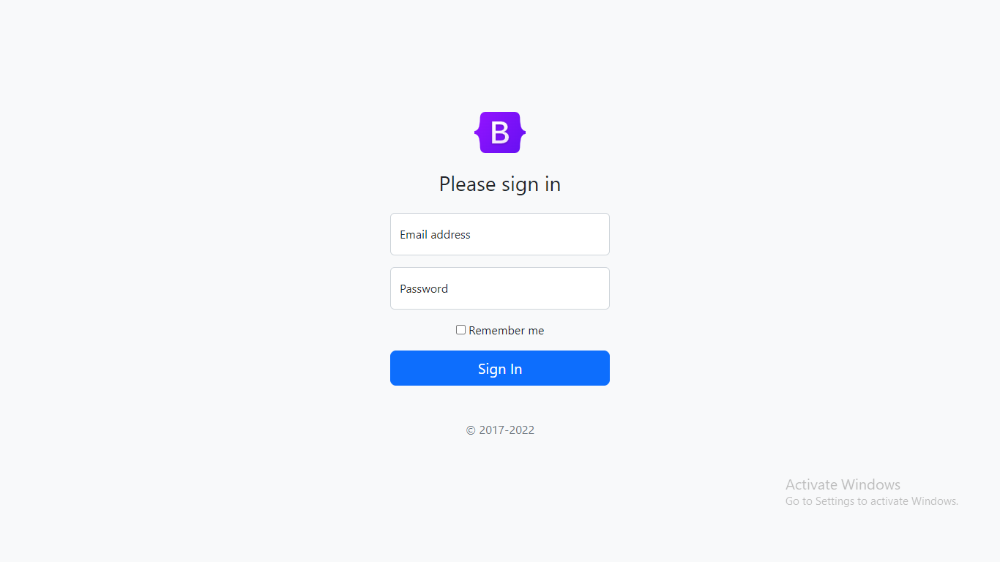

# Sign-in Form

## Description

This project is a simple sign-in form created using HTML and Bootstrap CSS. I have also used a little bit of CSS to design form elements.

### Preview of the sign-in form :-

### [**Live link**](https://sign-in-form-omega.vercel.app/) of the sign-in form.
